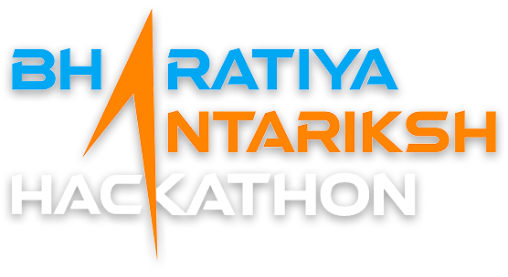

**This project is made for [Bharitya Antariksh Hackathon 2025](https://vision.hack2skill.com/event/bah2025) Organised by INDIAN SPACE RESEARCH ORGANISATION.**
# ARKA – Halo CME Detection
Arka is a scientific data analysis project focused on detecting **Halo Coronal Mass Ejection (CME)** events using **solar wind particle data** collected by the **SWIS-ASPEX payload onboard the Aditya-L1 mission**. Our goal is to contribute to an early warning system that can predict space weather events before they affect Earth and its orbiting satellites.
## 🌌 Project Motivation

The Sun drives solar particle flux, and sudden surges—especially those associated with **Halo CMEs**—can significantly disturb Earth's upper atmosphere and impact critical space infrastructure. By analyzing **Aditya-L1’s Level-2 particle data**, we aim to identify such events and visualize their particle flux characteristics.

---

## 🛠️ Tech Stack

- **Python** – data processing & visualization
- **Pandas** – for structured data manipulation
- **NumPy** – numerical analysis
- **Matplotlib** – plotting
- **SpacePy** – space physics analysis & CDF file support

---

## 📁 Data

The primary data source is:
- Format: `.cdf` (Common Data Format)
- Source: **SWIS-ASPEX Level-2** datasets from Aditya-L1